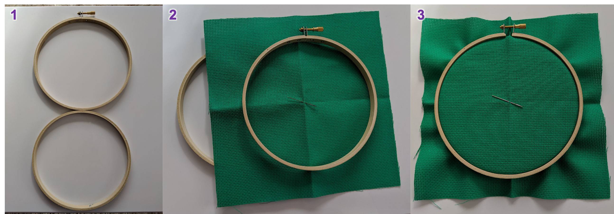
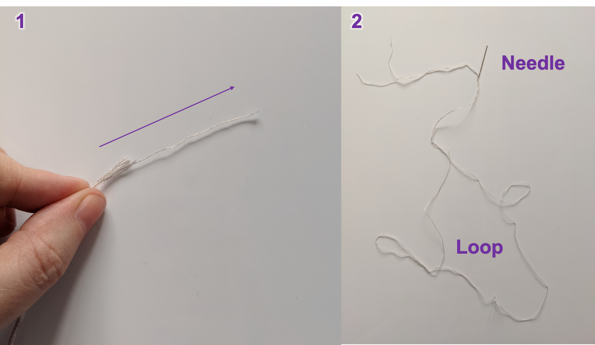

- [Fabric and needle](#fabric-and-needle)
- [Embroidery hoop](#embroidery-hoop)
- [Thread](#thread)

## Fabric and needle

It is always a good idea to start by looking for the the middle/center of your fabric.
This will allow you make sure your design is placed as intended in the fabric.

One way to do this is to fold the fabric in half and then half again.
You can then keep track of the centre by pushing the needle through the fold.

|  |
| :---: |
| _Figure 1: How to find the centre of you fabric and mark it with your needle._ |

<iframe width="560" height="315" src="https://www.youtube.com/embed/nVawkpj1T3g" frameborder="0" allow="accelerometer; autoplay; encrypted-media; gyroscope; picture-in-picture" allowfullscreen></iframe>

## Embroidery hoop

An embroidery hoop will help keep your fabric taut and your tension even while you stitch.

To fit your embroidery hoop: unscrew the fastening and separate the rings, then sandwich the fabric between the inner and outer rings.
On a flat surface, push the rings back together, trying to keep the centre of the fabric in the centre of the hoop.
Gently pull at the loose fabric around the edge while tightening the screw.
The fabric should be drum-tight.
If the screw is stiff, a flat-head screwdriver will help.

|  |
| :---: |
| _Figure 2: Fitting an embroidery hoop to the fabric._ |

<iframe width="560" height="315" src="https://www.youtube.com/embed/4Q4ieJCFBMo" frameborder="0" allow="accelerometer; autoplay; encrypted-media; gyroscope; picture-in-picture" allowfullscreen></iframe>

## Thread

Now for the thread!
Stranded-cotton is the go-to for cross stitch.
It’s made of 6 strands and is wound together in skeins.
First we need to cut a length of thread.

Choose the colour of thread that corresponds to the first stitch in the centre of the pattern.
We’re going to work from the centre out.
The ideal length of thread to stitch with measures from fingertip to elbow, so cut a section of thread this long.
Pull 1 strand out of the 6 and fold this over so the two ends meet.
Thread the two ends through the eye of the needle.
Most cross stitch patterns on 14 count aida require stitches made with 2 threads for suitable coverage of the fabric.
By folding the thread in half like this, we can do something called a loop start.

|  |
| :---: |
| _Figure 3: How to thread the needle in preparation for a loop start._ |

Congratulations, you're now ready to start stitching!
